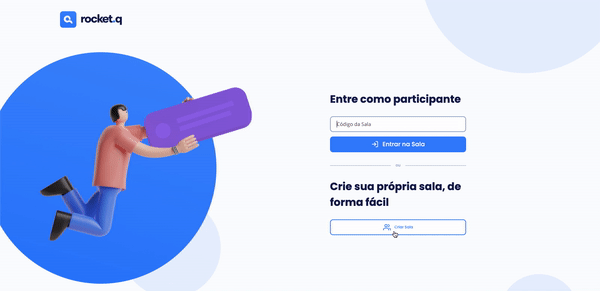
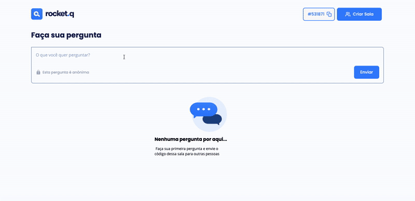

# Rocket.Q - Sala de perguntas

## Descrição do Projeto
Este projeto é uma página que gera uma sala onde podem ser realizadas perguntas anônimas. O criador da sala pode, então, marcar as perguntas como lidas ou excluí-las.

Criando uma sala com uma senha


Manipulando perguntas com a senha de administrador da sala


## Pré-requisitos
* git
* node
* npm

## Como rodar essa aplicação
```bash
# Clone este repositório
$ git clone https://github.com/juhanada/rocketseat-nlw6-mission-discover.git

# Acesse a pasta do projeto no terminal/cmd
$ cd rocketseat-nlw6-mission-discover

# Instale as dependências
$ npm install

# Execute
$ npm start
```

## Tecnologias utilizadas
* node js
* npm
* nodemon
* html
* css
* javascript
* ejs
* express
* sqlite
